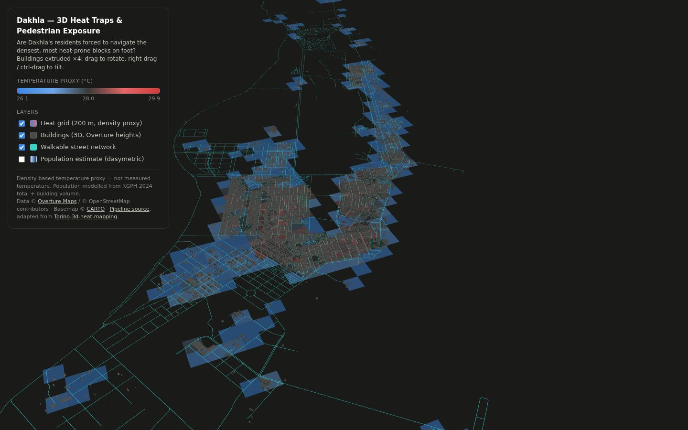
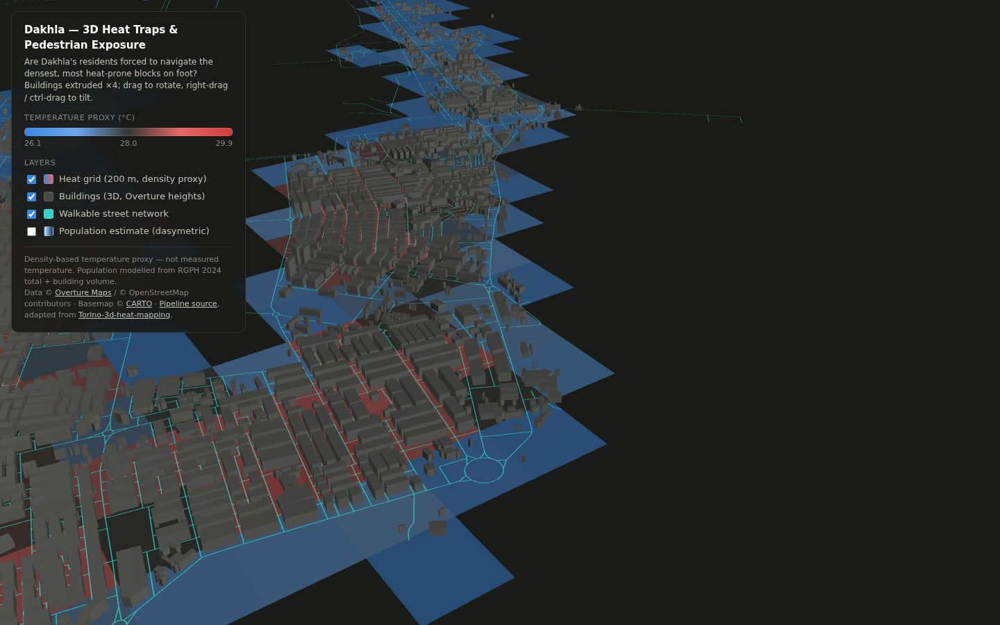
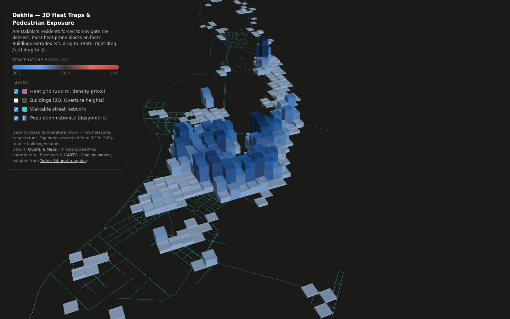
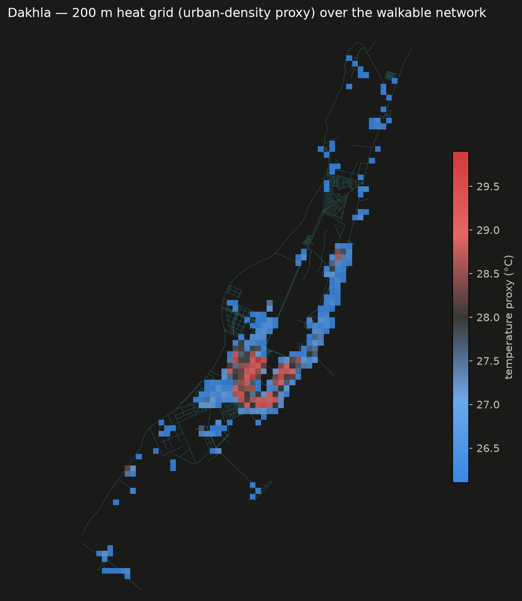

# 3D Heat Traps & Pedestrian Exposure in Dakhla

A spatial analysis pipeline that maps Dakhla's 3D urban geometry to find
dense blocks that trap heat, then overlays the walkable street network and
a population estimate to ask a concrete urban-planning question:

> **Are Dakhla's residents forced to navigate the densest, most heat-prone
> blocks during their daily walks?**

Adapted for Dakhla (Western Sahara) from
[fereshtehsabeghi/Torino-3d-heat-mapping](https://github.com/fereshtehsabeghi/Torino-3d-heat-mapping),
rebuilt on [Overture Maps](https://overturemaps.org/) GeoParquet +
[GeoPandas](https://geopandas.org/), and visualized with
[deck.gl](https://deck.gl/) (a ready-made scene ships in this repo) or
[Kepler.gl](https://kepler.gl/).

**▶ Interactive map: [`index.html`](index.html)** — served by GitHub Pages
at the site root once this branch is merged.



## Why this approach

A flat temperature map tells you *where* it's hot. It doesn't tell you
whether that heat is concentrated in dense, building-lined streets where
people on foot have no escape, or whether it overlaps with the blocks where
most residents actually live. Stacking 3D building geometry, a heat proxy,
the walkable network, and population in the same scene makes that
intersection visible and arguable, not just inferred.

Dakhla adds a twist the Torino original didn't have: the city sits on a
narrow Atlantic peninsula cooled by the Canary Current, so the *average*
summer day is mild (~26°C). The exposure that matters is the dense old-town
fabric that blocks the ocean breeze and stores heat — punished hardest
during episodic *chergui* (Saharan wind) events when temperatures spike.

| Old-town canyons, heat at street level | Where the people are (population columns) |
|---|---|
|  |  |



## Pipeline overview

```
scripts/01_fetch_overture_geometry.py → buildings (with height) + walkable network
scripts/02_generate_heat_grid.py      → 200m grid, urban density, temperature_proxy
scripts/03_integrate_demographics.py  → RGPH 2024 population distributed onto the grid
                                       ↓
                          index.html (deck.gl) or kepler.gl/demo
```

### 1. Urban geometry & walkable network (Overture Maps)

`scripts/01_fetch_overture_geometry.py` pulls Dakhla's building footprints
and street segments from the Overture Maps GeoParquet release on S3
(bbox-filtered, anonymous access — no Overpass server needed), resolves a
usable height per building (actual `height` attribute, falling back to
`num_floors` × 3.2m, falling back to a 4.5m low-rise default), and keeps
every walkable road class.

> The original Torino pipeline used OSMnx/Overpass. Overture bundles the
> same OSM geometry *plus* Microsoft/Google ML-detected footprints, which
> matters in Dakhla where hand-mapped OSM coverage is thinner than in a
> European city.

```bash
python scripts/01_fetch_overture_geometry.py
```

Outputs:
- `data/processed/dakhla_buildings_3d.geojson` (3,953 buildings, `calculated_height` property)
- `data/processed/dakhla_pedestrian_network.geojson` (5,243 segments)

### 2. Heat grid (density proxy, upgradeable to real LST/MRT)

`scripts/02_generate_heat_grid.py` builds a uniform 200m × 200m grid
(UTM 28N), intersects it with the buildings layer to compute urban density
per cell, and derives a `temperature_proxy` (26°C coastal baseline + up to
+6.5°C from density). This is a fast, defensible stand-in for real
microclimate data — see [`docs/heat_data_sources.md`](docs/heat_data_sources.md)
for how to swap it out for actual Landsat/Sentinel Land Surface Temperature
or a SOLWEIG Mean Radiant Temperature simulation.

```bash
python scripts/02_generate_heat_grid.py
```

Output: `data/processed/dakhla_heat_grid.geojson` (325 cells, proxy range 26.1–29.9°C)

### 3. Demographics (RGPH 2024)

`scripts/03_integrate_demographics.py` distributes Dakhla's official 2024
census population (161,723 — RGPH 2024) across the grid proportionally to
residential building volume (a dasymetric proxy), because Morocco's HCP
does not openly publish sub-communal census geodata the way Italy's ISTAT
does. Drop a real census polygon layer at `data/raw/census_sections.geojson`
and the script switches to area-weighted apportionment automatically — see
[`docs/demographic_data_sources.md`](docs/demographic_data_sources.md).

```bash
python scripts/03_integrate_demographics.py
```

Output: `data/processed/dakhla_demographics_grid.geojson` (`population_estimate` per cell)

### 4. Explore the scene

**Option A — bundled deck.gl scene (zero setup).** Open
[`index.html`](index.html) over HTTP:

```bash
python -m http.server   # then http://localhost:8000
```

Layers: translucent heat grid, buildings extruded ×4 and colored charcoal,
walkable network as thin cyan lines, and an optional population-column
overlay. deck.gl is vendored (`vendor/`), so only the CARTO basemap needs
the network.

**Option B — Kepler.gl.** Drag the generated GeoJSONs into
[kepler.gl/demo](https://kepler.gl/demo) and style them following
[`docs/kepler_setup.md`](docs/kepler_setup.md).

## Setup

```bash
python -m venv .venv
source .venv/bin/activate   # Windows: .venv\Scripts\activate
pip install -r requirements.txt
```

Then run the three scripts in order (1 → 2 → 3). Each one reads the output
of the previous step from `data/processed/`. Unlike the Torino original,
the processed GeoJSONs (~2.9MB total — Dakhla is a compact city) **are**
committed, so the GitHub Pages map works without running anything.

## Mini Rabat 3D

**▶ [`rabat3d/`](rabat3d/index.html)**: a 3D digital map of Rabat–Salé's
public transport in the spirit of [Mini Tokyo 3D](https://minitokyo3d.com/).
Tram lines L1 and L2 and the ONCF main line (TNR shuttles, Al Atlas
intercity, Al Boraq) move along their real tracks in Morocco local time,
with day/night lighting from the sun's position.

- **Click a tram or train** to follow it: speed, next stop, ETA and the
  full stop list with times. **Click a station** (or search for one) for
  its next departures.
- **Playback**: live, 10×, 60×, 300×, pause, or scrub to any time of day.
- **Real data**: track geometry, stop order and station positions come from
  OpenStreetMap. `scripts/rabat3d_build_network.py` turns the raw Overpass
  extracts in `data/rabat3d/raw/` into `rabat3d/data/network.json` (12 KB).
- **Simulated data**: departure times. Rabat has no public real-time or
  GTFS feed, so vehicles follow a timetable built from typical headways
  (tram every ~8–15 min, 06:00–22:00; lighter at weekends) and typical ONCF
  patterns. Movement uses an accelerate / cruise / brake profile with
  dwell times at every stop.
- **Stack**: MapLibre GL + deck.gl (vendored in `vendor/`), OpenFreeMap
  vector tiles for the 3D buildings (with a CARTO raster fallback). No
  build step and no API keys.

To rebuild the network after refreshing the OSM extracts:

```bash
pip install networkx
python scripts/rabat3d_build_network.py
```

## Caveats

- `temperature_proxy` is a **density-based proxy**, not measured
  temperature — clearly label it as such in any write-up, and see
  `docs/heat_data_sources.md` to upgrade to real LST/MRT data. In Dakhla
  specifically, density stands in for "blocks the sea breeze / stores
  heat", not for a classic inland heat island.
- `population_estimate` is a **model** (census total × residential building
  volume share), not counts; per-cell accuracy is unvalidated.
- Building heights are sparse in Overture for Dakhla; most buildings fall
  back to the 4.5m low-rise default, so the extrusion layer shows form more
  than measured height.

## License

MIT — see [LICENSE](LICENSE). Overture Maps data is licensed under
[ODbL](https://opendatacommons.org/licenses/odbl/) / CDLA-Permissive-2.0
depending on theme and includes OpenStreetMap data © OpenStreetMap
contributors. RGPH 2024 population figure © HCP Morocco.
