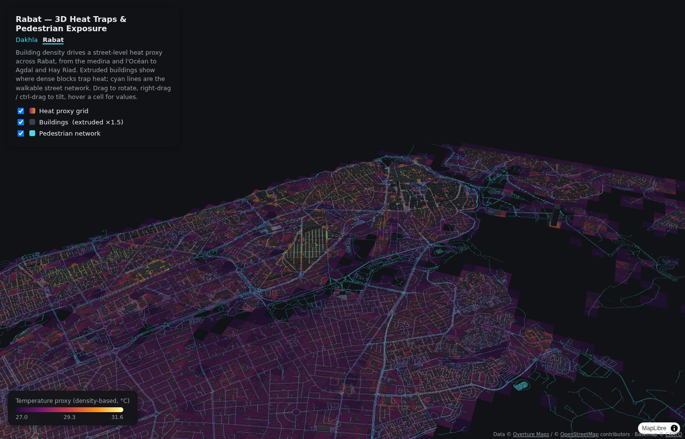
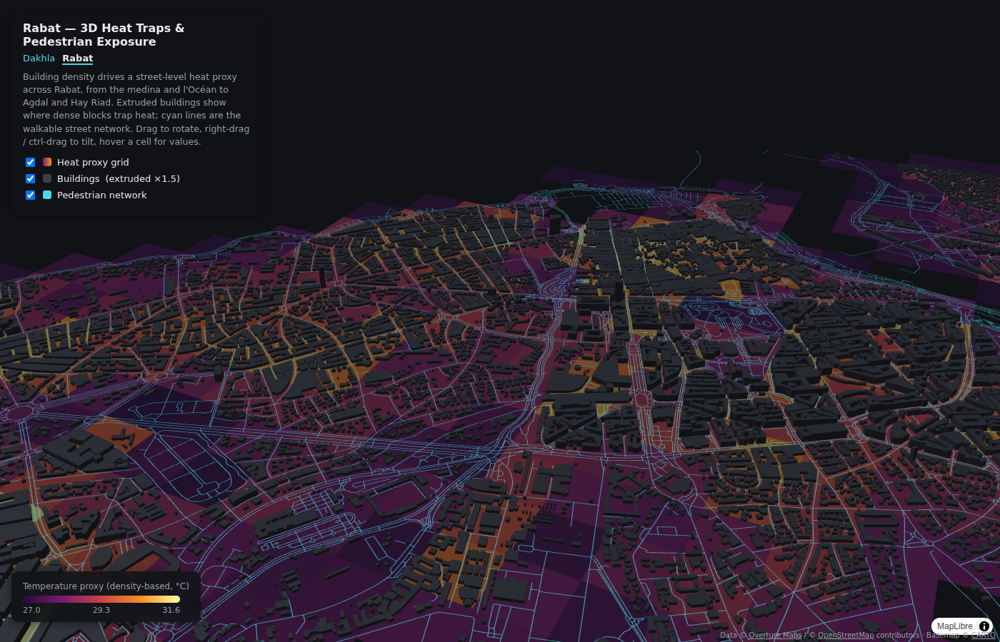

# 3D Heat Traps & Pedestrian Exposure — Dakhla & Rabat

A spatial analysis pipeline that maps a city's 3D urban geometry to find
"urban canyons" that trap heat, then overlays the pedestrian network and
(optionally) demographic data to ask a concrete urban-planning question:

> **Are residents forced to navigate the most severe heat traps during
> their daily movements through the city?**

Runs for two Moroccan-coast cities — **Dakhla** (Western Sahara) and
**Rabat** — from the same parameterized scripts. Adapted from
[Torino-3d-heat-mapping](https://github.com/fereshtehsabeghi/Torino-3d-heat-mapping)
by Fereshteh Sabeghi. Built with [DuckDB](https://duckdb.org/) +
[Overture Maps](https://overturemaps.org/), [GeoPandas](https://geopandas.org/),
and visualized with [deck.gl](https://deck.gl/).

**➡ Live interactive 3D map:
[Dakhla](https://adnanelabbaci.github.io/?city=dakhla) ·
[Rabat](https://adnanelabbaci.github.io/?city=rabat)**

| Dakhla peninsula | Rabat |
|---|---|
|  |  |

## Why this approach

A flat temperature map tells you *where* it's hot. It doesn't tell you
whether that heat is concentrated in narrow, building-lined streets where
people on foot have no escape. Both cities sit on the Atlantic and enjoy
ocean-moderated climates, but their dense, mineral urban fabric — tight
blocks with little shade or green space — still concentrates heat at street
level. Stacking 3D building geometry, a heat proxy, and the pedestrian
network in the same scene makes that intersection visible and arguable, not
just inferred.

| Dakhla old-town canyons | Rabat center |
|---|---|
|  |  |

## Differences from the Torino original

| | Torino | This repo |
|---|---|---|
| Data source | OSMnx (Overpass API) | Overture Maps GeoParquet on S3 via DuckDB — merges OSM with ML-derived footprints, important where raw OSM coverage is sparse |
| Cities | one, hardcoded | parameterized (`scripts/city_config.py`): Dakhla + Rabat, easy to add more |
| Metric CRS | EPSG:32632 (UTM 32N) | EPSG:32628 (Dakhla) / EPSG:32629 (Rabat) |
| Default building height | 15 m | 4.5 m Dakhla (1–2 storeys) / 6.4 m Rabat (2 storeys) |
| Heat baseline | 28 °C | 26 °C Dakhla / 27 °C Rabat (Atlantic-moderated) |
| Demographics | ISTAT census sections | HCP (Morocco) RGPH census districts — optional, skipped gracefully if the layer is absent |
| Visualization | manual Kepler.gl session | committed deck.gl page (`index.html`) with a city switcher, served by GitHub Pages |

## Pipeline overview

```
scripts/01_fetch_osm_geometry.py <city>      → buildings (with height) + pedestrian network (Overture)
scripts/02_generate_heat_grid.py <city>      → 200m grid, urban density, temperature_proxy
scripts/03_integrate_demographics.py <city>  → optional HCP census join (skips if no data)
                                              ↓
                            index.html?city=<city>  (deck.gl)
                or drag the GeoJSONs into kepler.gl/demo (docs/kepler_setup.md)
```

`<city>` is `dakhla` (default) or `rabat`; per-city parameters (bounding
box, UTM zone, height fallback, heat baseline) live in
`scripts/city_config.py` — add an entry there to cover another city.

### 1. Urban geometry & pedestrian network (Overture Maps)

`scripts/01_fetch_osm_geometry.py` queries Overture's public GeoParquet
release directly on S3 (no API keys, no Overpass rate limits), clips it to
the city bounding box, resolves a usable height per building (actual
`height`, falling back to `num_floors` × 3.2 m, falling back to the city's
low-rise default), and extracts every road segment a pedestrian can use
(everything except motorways/trunks).

```bash
python scripts/01_fetch_osm_geometry.py rabat
```

Outputs (`data/processed/`):
- `dakhla_buildings_3d.geojson` — 4,360 buildings; `dakhla_pedestrian_network.geojson` — 5,284 segments
- `rabat_buildings_3d.geojson` — 53,767 buildings; `rabat_pedestrian_network.geojson` — 25,614 segments

### 2. Heat grid (density proxy, upgradeable to real LST/MRT)

`scripts/02_generate_heat_grid.py` builds a uniform 200 m × 200 m grid,
intersects it with the buildings layer to compute urban density per cell,
and derives a `temperature_proxy` (city baseline + up to +6.5 °C from
density). This is a fast, defensible stand-in for real microclimate data —
see [`docs/heat_data_sources.md`](docs/heat_data_sources.md) for how to swap
it out for actual Landsat/Sentinel Land Surface Temperature or a SOLWEIG
Mean Radiant Temperature simulation.

```bash
python scripts/02_generate_heat_grid.py rabat
```

Outputs:
- `dakhla_heat_grid.geojson` — 520 cells, 26.1–32.5 °C proxy range
- `rabat_heat_grid.geojson` — 1,834 cells, 27.1–31.6 °C proxy range

### 3. Demographics (HCP, optional)

`scripts/03_integrate_demographics.py` apportions census-district population
(and elderly share) onto the same grid by area-weighted overlap. Morocco's
HCP does not openly publish district-level census geodata, so this step
**skips gracefully** when `data/raw/hcp_census_districts_<city>.geojson` is
absent — see
[`docs/demographic_data_sources.md`](docs/demographic_data_sources.md) for
how to source and prepare the layer.

```bash
python scripts/03_integrate_demographics.py rabat
```

Output (when input data is provided): `data/processed/<city>_demographics_grid.geojson`

### 4. Explore the scene

The committed [`index.html`](index.html) renders the three layers with
deck.gl over a dark CARTO basemap: heat as a translucent ground glow
(inferno-style sequential ramp), buildings extruded and colored dark
charcoal for contrast (×3 vertical exaggeration in low-rise Dakhla, ×1.5 in
Rabat), and the pedestrian network as thin cyan lines. City switcher, layer
toggles and hover tooltips are built in. Alternatively, drag the GeoJSONs
into [kepler.gl/demo](https://kepler.gl/demo) and follow
[`docs/kepler_setup.md`](docs/kepler_setup.md).

## Setup

```bash
python -m venv .venv
source .venv/bin/activate   # Windows: .venv\Scripts\activate
pip install -r requirements.txt
```

Then run the three scripts in order (1 → 2 → 3) for each city. Each one
reads the output of the previous step from `data/processed/`.

Behind a corporate proxy, set `HTTPS_PROXY` — the fetch script passes it
through to DuckDB. If DuckDB cannot reach `extensions.duckdb.org`, the
`duckdb-extension-httpfs` / `duckdb-extension-spatial` PyPI packages in
`requirements.txt` provide the extension binaries offline (copy them into
`~/.duckdb/extensions/<version>/<platform>/`).

## Caveats

- `temperature_proxy` is a **density-based proxy**, not measured
  temperature — clearly label it as such in any write-up, and see
  `docs/heat_data_sources.md` to upgrade to real LST/MRT data.
- Most extrusion heights come from per-city defaults (only ~7% of Rabat
  buildings and ~20% of Dakhla buildings carry an OSM height or floor
  count) — treat the third dimension as indicative, not surveyed. Notable
  exception: tagged landmarks like Rabat's 250 m Mohammed VI Tower carry
  their real height.
- A handful of fully-built 200 m cells (e.g. on Dakhla's eastern bay shore)
  are large industrial/agricultural compounds captured as ML-derived
  footprints, not urban canyons — the density proxy overstates pedestrian
  heat exposure there.
- Population apportionment by area-weighted overlap (step 3) is a
  simplification; dasymetric weighting by building footprint would be more
  accurate.

## License

MIT. Overture Maps data is © Overture Maps Foundation and its data sources,
including © OpenStreetMap contributors (ODbL). Basemap © CARTO.
