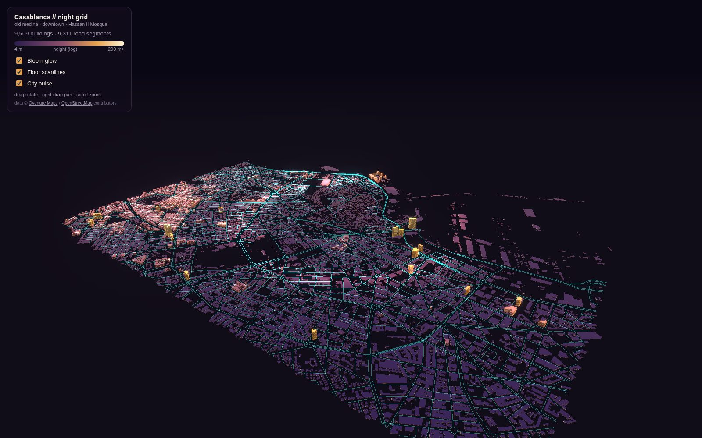
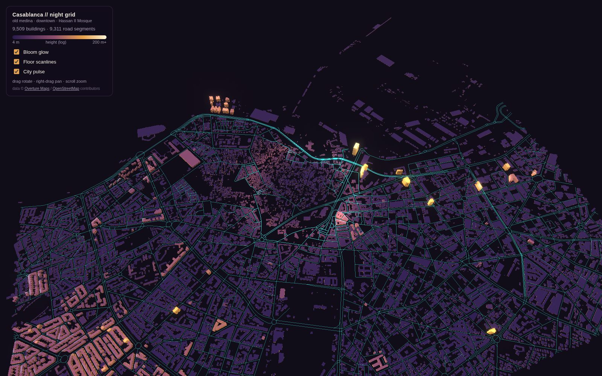

# Casablanca // Night Grid

A self-contained 3D data portrait of central Casablanca — 9,509 building
footprints across the old medina, the Art-Deco downtown around Boulevard
Mohammed V, and the Hassan II Mosque corniche, rendered as a neon night
grid. Everything ships as **one ~1.3 MB HTML file** with no servers, tiles,
or API keys.

**▶ Open the live viewer:** [`index.html`](index.html) — served by GitHub
Pages at `/casablanca-night-grid/` once this branch is merged.

Adapted from [amyxqc/auckland-night-grid](https://github.com/amyxqc/auckland-night-grid)
(itself adapted from Milan Janosov's Manhattan night grid), retargeted to
Casablanca on [Overture Maps](https://overturemaps.org/) data.





## What you're looking at

- **Every light is a record** — an Overture/OSM building footprint extruded
  to its best-known height: the measured `height` attribute where one
  exists (35 buildings, topped by the 115 m Twin Center towers), else
  `num_floors` × 3.2 m (1,434 buildings), else a 4.5 m low-rise default —
  honest for the 1–2 storey medina fabric that dominates the unknowns.
- **Height drives color** on a log ramp from deep indigo (4 m) through
  mulberry and gold to warm white (200 m+) — a night-time nod to
  *la ville blanche*.
- **The teal grid** is the street network (motorway → living street +
  pedestrian ways), with a luminous pulse radiating from the center.
- Bloom, floor scanlines, and the pulse are toggleable in the panel;
  drag to rotate, right-drag to pan, scroll to zoom.

## Coverage

Bounding box `(-7.645, 33.582) – (-7.595, 33.618)`, about 4.8 × 3.9 km:
the old medina, Place des Nations Unies, the Boulevard Mohammed V downtown,
Casa-Port, the Hassan II Mosque, and the northern edge of Maârif with the
Twin Center.

## How it's built

```
build/fetch_casablanca.py   Overture GeoParquet on S3 (anonymous, bbox-filtered)
                            → datasets/casablanca_{buildings,roads}.geojson
build/pack_casablanca.py    reproject to UTM 29N → quantize to decimeters →
                            delta-encode Int16 → base64 typed arrays →
                            inject into build/template.html with vendored libs
build/template.html         viewer (three.js r147 + earcut, custom shaders)
build/vendor/               pinned three@0.147.0 + earcut@2.2.4, trimmed to
                            the ten files the packer inlines
index.html                  the built, self-contained viewer
```

Rebuild:

```bash
pip install geopandas pyarrow s3fs shapely numpy pandas
python3 build/fetch_casablanca.py   # ~2 min, pulls from Overture S3
python3 build/pack_casablanca.py    # writes index.html
```

Why Overture rather than the Overpass/OSMnx path the Auckland original
used: Overture bundles OSM geometry with Microsoft- and Google-ML-detected
footprints and heights, which matters in Casablanca where hand-mapped OSM
attribute coverage is thin (the same reasoning as this repo's Dakhla
pipeline).

## Data & licenses

Data © [Overture Maps Foundation](https://overturemaps.org/) (ODbL/CDLA),
incorporating [OpenStreetMap](https://www.openstreetmap.org/copyright)
contributors (ODbL). Vendored libraries: three.js (MIT), earcut (ISC) —
see `build/vendor/`. The raw GeoJSONs in `datasets/` are not committed;
re-fetch with the script above.
