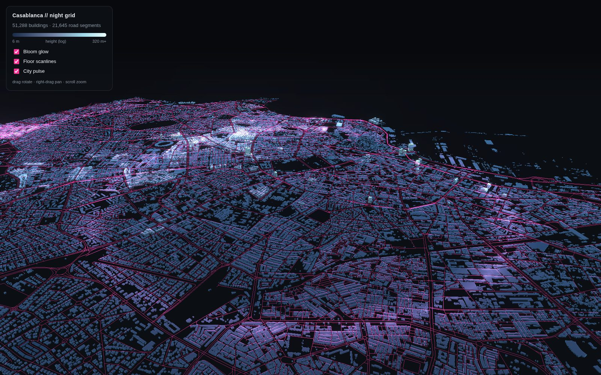
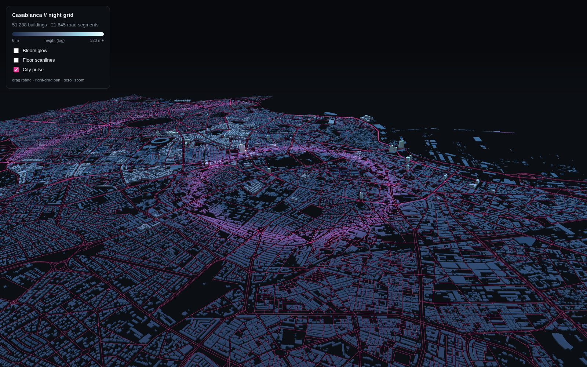

# Casablanca // night grid

A cinematic sci-fi 3D visualization of central Casablanca — 51,288 extruded
building footprints over a glowing neon-pink drivable street grid — packed
into **one fully self-contained HTML file** with zero network requests at
runtime.

**▶ Open [`../casablanca-night-grid.html`](../casablanca-night-grid.html)**
(3.9 MB, everything inlined: three.js r147, post-processing passes, earcut,
and the city data itself as base64 typed arrays).



Bloom, floor scanlines and the radial "city pulse" wave are toggleable from
the panel:



## Data

- **Coverage**: central Casablanca, bbox (-7.68, 33.55) → (-7.56, 33.62) —
  old medina, port, Hassan II Mosque, Maarif/CFC towers (max height 122 m),
  Ain Diab. 51,288 buildings, 21,645 drivable road segments.
- **Source**: [Overture Maps](https://overturemaps.org/) 2026-06-17.0
  GeoParquet (bbox-filtered anonymous S3 reads). The original recipe used
  OSMnx (Nominatim + Overpass), but both hosts are blocked by this
  environment's egress policy; Overture carries the same OSM geometry plus
  ML-detected footprints. Only 7.1% of buildings have a real height —
  the rest render at the 8 m default.
- **CRS**: EPSG:32629 (UTM 29N, meters).

## Packing scheme

Raw GeoJSON would be ~32 MB; the payload in the HTML is ~3.2 MB:

- coordinates quantized to decimeters relative to the buildings'
  min-x/min-y origin (shared by roads);
- per ring/polyline: first vertex as an Int32 pair, the rest as Int16
  delta pairs (edges that would overflow Int16 are subdivided); duplicate
  and ring-closing vertices dropped; rings with <3 points skipped;
- sidecar arrays: ring lengths (Uint16), ring role (Uint8, 0=outer /
  1=hole), rings per building (Uint8), heights (Float32, 0=unknown);
- each typed array base64-encoded separately (little-endian) into
  `const P = {...}`.

At load, JS decodes the arrays and builds a **single non-indexed mesh**
(~1M triangles, one draw call): walls extruded per ring edge, roofs
triangulated with earcut, shading baked into Uint8 vertex colors
(log-height ramp `#1b2b4a → #7484a6 → #9fd8e8 → #eaffff`, lambert walls,
×1.15 roofs), Int8 normals. Roads are additive-blended `LineSegments`.
Custom fragment shaders add floor scanlines, a fresnel rim, and the
radial pulse; an `UnrealBloomPass` composer supplies the glow.

## Pipeline

```
python3 01_fetch_casablanca.py   # Overture S3 → two GeoJSONs (UTM 29N)
python3 02_pack_data.py          # GeoJSON → payload.json (base64 typed arrays)
python3 03_assemble_html.py      # libs + payload + app.js → casablanca-night-grid.html
node 04_smoke_test.js casablanca-night-grid.html   # payload self-consistency
node 05_browser_test.js casablanca-night-grid.html # headless render, CSP-locked
```

`03_assemble_html.py` expects three.js 0.147.0 and earcut 2.2.4 unpacked
under `libs/` (`npm pack three@0.147.0 earcut@2.2.4`, then extract).
Python deps: `geopandas pyarrow s3fs shapely numpy`; the browser test uses
`playwright-core` with a system Chromium.

The headless test loads the file behind a `default-src 'none'` Content
Security Policy and asserts zero console errors and zero network requests,
then exercises the UI toggles.
