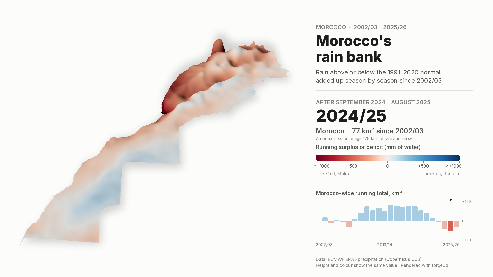

# Morocco's rain bank, 2002/03 – 2025/26

How much rain Morocco has banked, or missed, since 2002: for every place, the
precipitation of each season (September–August) above or below its
1991–2020 normal, added up season after season. In this 3D map height and
colour show the same thing: blue rises where the running total is a surplus,
red sinks where it is a deficit. Rendered with
[forge3d](https://github.com/milos-agathon/forge3d), like the
[September temperature](../morocco_september_anomalies/) and
[fifty-year rainfall](../morocco_rainfall_50_years/) animations.

**▶ [Watch the animation](output/morocco_rain_bank_2002_2026.mp4)** ·
[GIF](output/morocco_rain_bank_2002_2026.gif) ·
[page](index.html) (served by GitHub Pages)



## What it shows, and what it doesn't

This started as a Moroccan version of the GRACE groundwater maps (JPL
mascons minus GLDAS soil water, as in the well-known Saudi Arabia map). That
was not possible from where it was built:

- **GRACE / GRACE-FO and GLDAS** live on NASA (PO.DAAC, GES DISC), CSR and
  GFZ servers, which this environment cannot reach, and Earth Engine needs an
  account.
- **ERA5's own soil water** is not a usable substitute over Morocco: its
  deepest layer (1.0–2.9 m) more than doubles overnight on 1 January 2015
  (0.053 → 0.127 m³/m³ averaged over Moroccan land), a jump at one of ERA5's
  production-stream boundaries, and the 28–100 cm layer then *rises*
  through the 2019–2024 drought as it drifts. A storage map from it would
  show a fake 2015 "gain".

What ERA5 does well is precipitation (checked against station normals in
the rainfall project), and rain is the recharge groundwater lives on. So
this map shows the **cumulative precipitation surplus or deficit since
2002/03**: the water that did or did not arrive. It cannot show pumping,
which is what drains aquifers in the Souss, Saïss or Tadla while the rain
bank looks healthy. Read it as the climate side of Morocco's water balance,
not as groundwater.

## What it says

Over Morocco's land area (682,000 km² on the equal-area grid), where a
normal season brings 128 km³ of rain and snow:

- 2002/03 – 2007/08 hovered around zero (−46 to +26 km³).
- The wet run from 2008/09 to 2014/15 banked a surplus of **+126 km³** by
  2014/15, about one normal season's worth.
- From 2018/19 the drought drew it down every season, from +112 km³
  after 2017/18 to **−77 km³** after 2024/25: **189 km³** in seven seasons,
  about 27 km³ a year, or a fifth of a normal season's rain missing each year.
- 2025/26 (122 % of normal) put back 29 km³, to −48 km³.

The north-west (Gharb, Saïss, Rif foothills), the wettest and most
water-dependent part of the country, carries the deepest deficit.

## Pipeline

```
../morocco_rainfall_50_years/data/morocco_precip_hydro_years_1976_2026.nc
scripts/01_cumulative_balance.py  → data/morocco_cumulative_rain_anomaly_2002_2026.nc
scripts/02_render_animation.py    → output/*.mp4, *.gif, *_peak/_low/_latest.png
```

The seasonal ERA5 precipitation comes from the rainfall project (run its
`01_fetch_era5_precipitation.py` first); the terrain grid, outline and
forge3d code (`scripts/drape.py`) from the September project.

```bash
python scripts/01_cumulative_balance.py
xvfb-run -a -s "-screen 0 1920x1080x24" python scripts/02_render_animation.py
xvfb-run -a python scripts/02_render_animation.py --preview 2024   # one frame
```

### How the 3D works

Here the data is the terrain: every season writes a new surface whose
height is the running total (±1,000 mm, clipped), and forge3d renders its
country mask, relief and colour passes. Two details matter:

- forge3d's terrain viewer scales each surface to its own min–max, which
  would make every season look equally dramatic. Two marker cells in the
  grid corners, outside the country, pin every surface to the same ±1,000 mm
  range, so zero stays at the same level and 500 mm sinks equally deep in
  every frame.
- The surface continues past the border (the country mask clips it);
  leaving the surroundings empty drops sheer, jagged walls at every border.

Seasons rest for half a second and cross-fade into the next. 24 forge3d
surfaces take about 20 minutes on a CPU-only machine (Mesa lavapipe).

## Caveats

- ERA5 is a ~28 km reanalysis and smooths mountain rainfall; the field is
  interpolated onto the 1 km grid.
- The running total depends on the start year (2002/03, the start of the
  GRACE era) and on the 1991–2020 normal.
- July–August 2026 is preliminary ERA5T.

## Credits

- Precipitation: Hersbach et al. (2020), ERA5, Copernicus Climate Change
  Service (C3S) / ECMWF; via WeatherBench 2 and ARCO-ERA5 (Google Research).
  Contains modified Copernicus Climate Change Service information.
- Outline: Natural Earth (public domain).
- Rendering: [forge3d](https://github.com/milos-agathon/forge3d) by Milos Popovic
  (Apache-2.0 / MIT).
