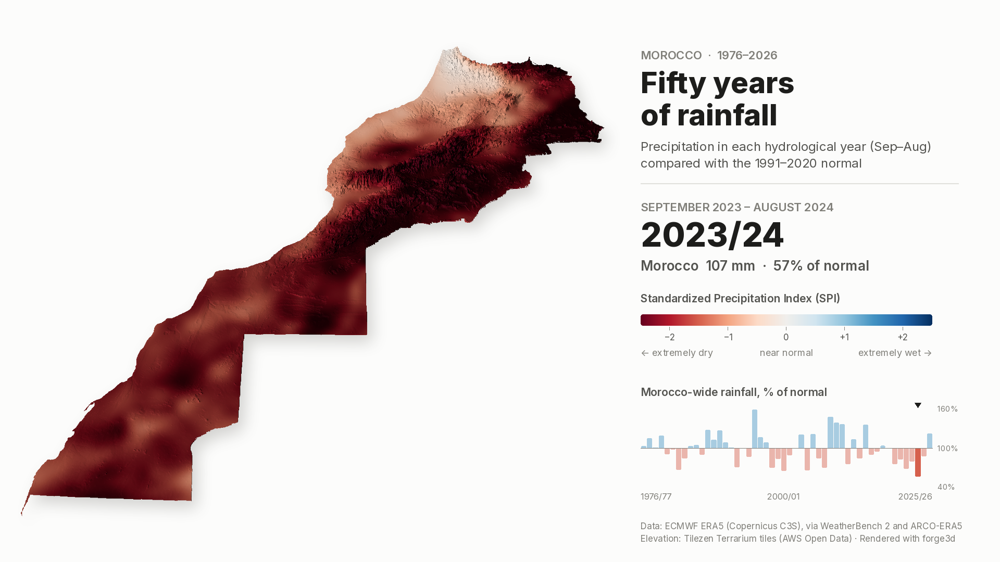

# Morocco, fifty years of rainfall (1976/77 – 2025/26)

Fifty rainy seasons, one after another: how wet or dry each hydrological year
was across Morocco compared with the 1991–2020 normal, draped over the
country's relief and rendered with [forge3d](https://github.com/milos-agathon/forge3d).
A companion to the [September temperature animation](../morocco_september_anomalies/)
and built on the same terrain and rendering code.

**▶ [Watch the animation](output/morocco_rainfall_1976_2026.mp4)** ·
[GIF](output/morocco_rainfall_1976_2026.gif) ·
[page](index.html) (served by GitHub Pages)



## What the map shows

- **Season** – a hydrological (agricultural) year, 1 September to 31 August,
  so each rainy season (October–April) stays in one piece. 1995/96 means
  September 1995 – August 1996.
- **Map colour** – the 12-month Standardized Precipitation Index (SPI), the
  WMO's recommended drought index. For every 0.25° cell a gamma distribution
  is fitted to its 1991/92–2020/21 totals, and each season is placed on that
  cell's own curve: 0 is a typical year, ±1 happens about one year in six,
  ±2 about one year in forty. Red is dry, blue is wet, on a graduated scale
  through a neutral grey at 0.
- **Numbers and bars** – the Morocco-wide precipitation in mm and as a share
  of the 1991–2020 normal (187 mm), area-weighted over land.

Why SPI for the map and not "% of normal"? Over the hyper-arid south a normal
year brings 20–60 mm, so a single storm, or its absence, swings the share of
normal between 20 % and 300 %. Year-to-year variability there is 2.4 times
that of the north (coefficient of variation 0.72 vs 0.30), and on a
%-of-normal map a fifth of the southern cells hit the extreme colours against
2 % in the north, so the desert would flicker from deep red to deep blue
and drown out the north, where most of the rain falls. SPI rates every place
against its own variability, so extremes are equally rare everywhere.

Seasons rest for a quarter of a second, then cross-fade into the next; the
season label switches halfway through each fade.

The outline is Morocco including its southern provinces, shared with the
September project (`BOUNDARY_ADMINS` in
`../morocco_september_anomalies/scripts/common.py`).

## Pipeline

```
scripts/01_fetch_era5_precipitation.py  → data/morocco_precip_hydro_years_1976_2026.nc
scripts/02_render_animation.py          → output/*.mp4, *.gif, *_driest/_wettest/_latest.png
```

Terrain (`morocco_dem_laea_1km.tif`) and the forge3d draping code
(`scripts/drape.py`) come from `../morocco_september_anomalies/`; run its
`02_prepare_terrain.py` first if that DEM is missing.

### 1. ERA5 precipitation

ERA5 precipitation is read from two public copies on Google Cloud, so no
Copernicus CDS account or API key is needed:

| Period | Source | Fields per season |
|---|---|---|
| Sept 1976 – 10 Jan 2023 | [WeatherBench 2](https://weatherbench2.readthedocs.io/) ERA5 daily and 7-day totals | 52 weekly + 1–2 daily |
| 11 Jan 2023 – Aug 2026 | [ARCO-ERA5](https://github.com/google-research/arco-era5) hourly accumulations | 24 per day |

Both are aggregates of the same hourly ERA5 accumulations. A WeatherBench 2
day is the 24 hourly accumulations stamped 01:00 … 24:00 UTC (checked: the
two agree to 0.0000 mm), and the hourly part sums the same window, so the
sources splice without a gap or overlap. Each 0.25° field is global, so the
script streams about 34,000 fields (≈ 65 GB, 5–10 minutes at ~100 MB/s) and
keeps only the Morocco box; each season's total is cached in `.cache/` so a
rerun is instant.

```bash
python scripts/01_fetch_era5_precipitation.py
```

The NetCDF output holds `precip` (mm per season), `precip_normal`,
`precip_ratio` and `spi` on the 0.25° grid. July–August 2026 is preliminary
ERA5T (final ERA5 runs ~3 months behind); the 2025/26 frame says so.

### 2. forge3d render

Each season's SPI field is interpolated (cubic spline) onto the 1 km terrain
grid and draped over the relief in forge3d's terrain viewer, with the same
camera, light and two-pass recipe as the September animation: a relief pass
rendered once, a colour pass per season with `preserve_colors` so the colours
match the legend, the two multiplied, then framed and encoded with ffmpeg
(H.264 MP4 at 24 fps, plus a 960 px GIF). Fifty forge3d renders and the
cross-fades take about 15 minutes on a CPU-only machine.

```bash
# with a GPU
python scripts/02_render_animation.py
# headless Linux: software Vulkan (Mesa lavapipe) + a virtual display
xvfb-run -a -s "-screen 0 1920x1080x24" python scripts/02_render_animation.py
# one composed frame, e.g. the 1995/96 season
xvfb-run -a python scripts/02_render_animation.py --preview 1995
```

## What fifty years of ERA5 say

Morocco-wide precipitation, share of the 1991–2020 normal:

- **Driest:** 2023/24 at 57 %, the fifth of six seasons in a row below
  normal (2019/20 – 2024/25: 76, 83, 69, 80, 57 and 88 %).
- **Wettest:** 1995/96 at 159 %, then 2008/09 (148 %), 2009/10 (139 %),
  2010/11 (137 %) and 2014/15 (136 %).
- **Other dry seasons:** 2000/01 (65 %), 1982/83 and 2004/05 (67 %),
  2021/22 (69 %), 1998/99 (70 %), 1992/93 and 2007/08 (71 %).
- **2025/26:** 122 %, the wettest season since 2014/15 and the end of the
  dry run.

## Caveats

- ERA5 is a ~28 km reanalysis: it smooths mountain rainfall (the Middle
  Atlas around Ifrane gets ~680 mm in ERA5 against ~1,100 mm at the station)
  and does not resolve individual storms. It is consistent through time,
  which is what a fifty-year comparison needs, but it is not station data.
- SPI from a two-parameter gamma fit on 30 seasons is the standard recipe;
  in the driest cells the fit rests on small totals and is less certain.
- The 1 km terrain sharpens the relief, not the rainfall field.

## Credits

- Precipitation: Hersbach et al. (2020), ERA5 hourly data, Copernicus
  Climate Change Service (C3S) / ECMWF; accessed through WeatherBench 2
  (Rasp et al. 2024) and ARCO-ERA5 (Google Research). Contains modified
  Copernicus Climate Change Service information.
- SPI: McKee, Doesken & Kleist (1993); WMO-No. 1090 (2012).
- Elevation: Tilezen Terrarium tiles (SRTM, GMTED2010, ETOPO1 and others),
  AWS Open Data. Outline: Natural Earth (public domain).
- Rendering: [forge3d](https://github.com/milos-agathon/forge3d) by Milos Popovic
  (Apache-2.0 / MIT).
