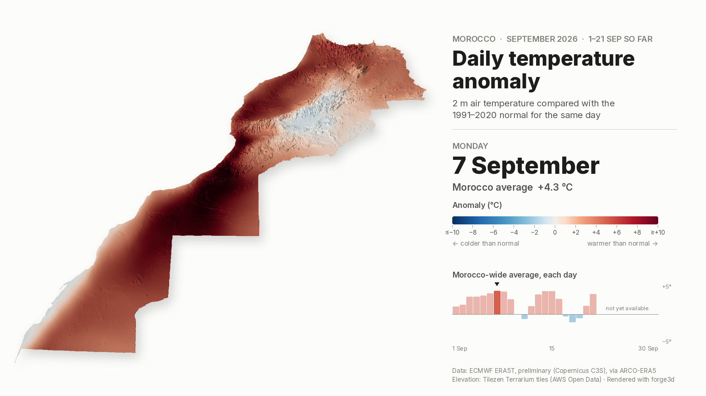

# Morocco, September: daily temperature anomalies

Day-by-day animations of how much warmer or colder than normal each part of
Morocco was through September, draped over the country's relief and
rendered with [forge3d](https://github.com/milos-agathon/forge3d).

| | Animation | |
|---|---|---|
| **September 2026** (1–21 Sep so far, preliminary ERA5T) | [MP4](output/morocco_t2m_anomaly_sep2026.mp4) · [GIF](output/morocco_t2m_anomaly_sep2026.gif) | [page](index.html) |
| **September 2025** (complete month) | [MP4](output/morocco_t2m_anomaly_sep2025.mp4) · [GIF](output/morocco_t2m_anomaly_sep2025.gif) | |



**September 2026 is still in progress.** ERA5 is published about five days
behind real time, so the 2026 animation covers 1–21 September and uses
preliminary ERA5T data. Re-run steps 1 and 3 with `--year 2026` in early
October to complete it; ERA5T is replaced by final ERA5 about three months
later, with changes that are usually small.

## What the map shows

For every day *d* of September:

```
anomaly(d) = daily mean 2 m temperature(d)  −  1991–2020 normal for d
```

- **Daily mean** – average of the 00, 06, 12 and 18 UTC ERA5 fields.
- **Normal** – the same four-hour daily mean averaged over 1991–2020 (the
  current WMO climate normal), for the same calendar day, smoothed with an
  11-day centred window. Each day's normal therefore rests on 30 years × 11
  days of data, which removes day-to-day noise from the baseline without
  flattening the late-summer cooling trend (Marrakech's normal drops from
  26.4 °C on 1 Sept to 22.7 °C on 30 Sept).
- **Colour** – a diverging blue ↔ red scale with a neutral grey at 0 °C,
  fixed at ±10 °C for every frame so days are comparable. Values beyond are
  shown at the end colour.
- **Morocco-wide average** – the area-weighted mean over land (the terrain
  grid is equal-area), shown under the date and as the 30-bar strip.

Between days the field is cross-faded with a smoothstep ease so each day
settles on screen; the date label switches at the midpoint.

The outline is Morocco including its southern provinces (Natural Earth
`Morocco` + `Western Sahara`, dissolved). Change `BOUNDARY_ADMINS` in
`scripts/common.py` to use a different outline.

## Pipeline

```
scripts/01_fetch_era5_anomalies.py  → data/morocco_t2m_anomaly_sep<year>.nc
scripts/02_prepare_terrain.py       → data/morocco_dem_laea_1km.tif, data/morocco_boundary.geojson
scripts/03_render_animation.py      → output/*.mp4, *.gif, *_peak.png
```

### 1. ERA5 anomalies

Reads ERA5 from [ARCO-ERA5](https://github.com/google-research/arco-era5), the
analysis-ready copy of ECMWF ERA5 that Google hosts as public Zarr on Cloud
Storage. No Copernicus CDS account or API key is needed, and only the Morocco
box (18.5°W–0°, 20–37°N, 0.25°) is kept in memory. The baseline takes about
4,800 hourly fields (≈11 GB streamed, a few minutes on a fast link) and is
cached in `.cache/` so later runs for other years only fetch the target month.

```bash
python scripts/01_fetch_era5_anomalies.py --year 2026
```

The NetCDF output holds `t2m`, `t2m_normal` and `t2m_anomaly` (°C, 30 days ×
69 × 74). ARCO-ERA5 carries final ERA5 with a ~3-month lag plus preliminary
ERA5T up to about five days ago. For a month still in progress the script
stops at the last ERA5T day; the frames then show "1–N Sep so far", mark the
remaining days of the strip as not yet available, and credit ERA5T.

### 2. Terrain

Natural Earth 10 m admin-0 outline, and elevation from
[Tilezen Terrarium](https://github.com/tilezen/joerd) tiles on AWS Open Data
(zoom 8), mosaicked, averaged onto a 1 km Lambert azimuthal equal-area grid
centred on Morocco and masked to the outline (1613 × 1678 cells).

```bash
python scripts/02_prepare_terrain.py
```

### 3. forge3d render

Each day's 0.25° anomaly field is interpolated (cubic spline) onto the 1 km
terrain grid and draped over the relief in forge3d's terrain viewer
(15× vertical exaggeration, sun from the north-west, PCSS shadows and
height-field ambient occlusion). Every frame combines two forge3d passes:

- a **relief pass** – neutral grey drape, fully lit – rendered once, since the
  camera and sun never move;
- a **colour pass** – the day's anomaly colours with `preserve_colors`, so
  they match the legend exactly – rendered per frame.

The colour pass is multiplied by the relief shading, framed with the title,
date, colour bar and daily strip, and encoded with ffmpeg (H.264 MP4 at
24 fps, plus a 960 px GIF).

```bash
# with a GPU
python scripts/03_render_animation.py --year 2026
# headless Linux: software Vulkan (Mesa lavapipe) + a virtual display
sudo apt-get install mesa-vulkan-drivers xvfb libxkbcommon-x11-0 ffmpeg
xvfb-run -a -s "-screen 0 1920x1080x24" python scripts/03_render_animation.py --year 2026
# one composed frame, e.g. to tune the look
xvfb-run -a python scripts/03_render_animation.py --preview 18
```

On lavapipe (CPU only) a frame takes a few seconds; a full month (233
frames) takes 40–80 minutes.

Note on forge3d units: the terrain viewer clamps the orbit radius to 50 000
world units and takes horizontal units from the GeoTIFF transform, so the
render script writes a temporary surface at 1 unit per 1 km cell with heights
in km × exaggeration, rather than feeding it the metre-based DEM directly.

## Setup

```bash
python -m venv .venv && source .venv/bin/activate
pip install -r morocco_september_anomalies/requirements.txt
cd morocco_september_anomalies
python scripts/01_fetch_era5_anomalies.py
python scripts/02_prepare_terrain.py
xvfb-run -a python scripts/03_render_animation.py
```

## Caveats

- ERA5 is a 0.25° (~28 km) reanalysis. The 1 km terrain sharpens the relief,
  not the temperature field: small valleys, coastal fog belts and city heat
  islands are not resolved, and the smooth colour gradients are interpolation.
- ERA5 2 m temperature over the High Atlas follows ERA5's own smoothed
  orography, so mountain anomalies are representative of the ~28 km cell.
- A four-synoptic-hour daily mean differs slightly from a 24-hour mean; the
  anomaly is unaffected because the baseline uses the same four hours.

## Credits

- Temperature: Hersbach et al. (2020), ERA5 hourly data, Copernicus Climate
  Change Service (C3S) / ECMWF; accessed through ARCO-ERA5 (Google Research).
  Contains modified Copernicus Climate Change Service information.
- Elevation: Tilezen Terrarium tiles (SRTM, GMTED2010, ETOPO1 and others),
  AWS Open Data.
- Outline: Natural Earth (public domain).
- Rendering: [forge3d](https://github.com/milos-agathon/forge3d) by Milos Popovic
  (Apache-2.0 / MIT).
